# 从轨迹规划到 IGO 博弈：黑箱轨迹优化入门

这份文档面向没有做过黑箱优化的人。它不会一上来就讲 CMA-ES、IGO、SVGD 或博弈，而是先回答一个更基本的问题：**轨迹规划本质上到底在优化什么？**

读完之后，你应该能理解：

- 为什么轨迹规划可以被写成一个优化问题。
- 为什么 iLQR 这类传统梯度优化方法很强，但并不总适合复杂交互规划。
- 为什么黑箱优化可以处理不可导、非光滑、非 Markov 的规划 cost。
- 参数化轨迹和非参数化轨迹各自意味着什么。
- CMA-ES、IGO、SVGD 分别在优化框架里扮演什么角色。
- 为什么本项目把 IGO 扩展到博弈层，联合生成自车与他车轨迹。
- 为什么博弈规划不能只看 joint cost 是否收敛，而需要 Nash / regret 检查。

本文不是论文式推导，而是工程落地视角的讲解：**先把问题讲清楚，再把算法放进去，最后映射到本项目代码。**

---

## 1. 轨迹规划本质在优化什么

轨迹规划不是简单地“画一条线”，它本质是在当前环境中，从很多可能的未来轨迹里选出一条最合适的。

一条未来轨迹可以写成：

```text
τ = {x0, x1, x2, ..., xN}
```

其中每个 `xk` 表示第 `k` 个时刻的车辆状态，比如：

```text
xk = [s, l, v, a, yaw, kappa, ...]
```

在 Frenet 坐标系下，最常见的是：

- `s`：沿参考线方向的纵向位置。
- `l`：相对于参考线的横向偏移。
- `v`：速度。
- `a`：加速度。
- `kappa`：曲率。
- `dkappa`：曲率变化率。

规划器要做的是：

```math
τ^* = \arg\min_{τ \in \mathcal{T}} J(τ)
```

这里：

- `τ` 是一条候选轨迹。
- `𝒯` 是所有满足基本边界和动力学要求的候选轨迹集合。
- `J(τ)` 是这条轨迹的总代价。

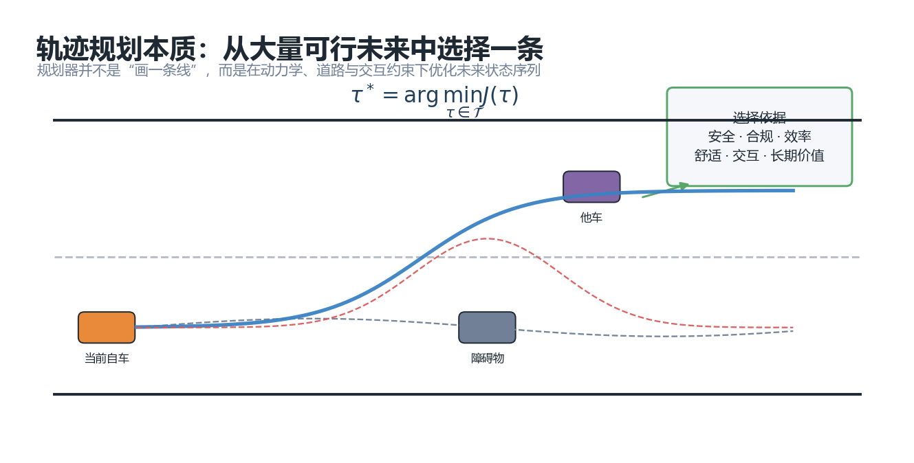

这个 cost 往往不是一个简单的函数，而是很多目标的组合：

```text
J(τ) =
    安全代价
  + 道路边界代价
  + 动力学约束代价
  + 舒适性代价
  + 效率代价
  + 参考线吸引代价
  + 交互代价
  + 轨迹级长期价值代价
```

在本项目里，典型的参数化轨迹 cost 层级是：

```text
total =
    1e9 * collision_score
  + 1e8 * road_score
  + 1e7 * kappa_hard_score
  + 1e6 * dkappa_hard_score
  + 1e5 * lateral_accel_hard_score
  + 1e4 * lateral_jerk_hard_score
  + 1e3 * efficiency_score
  + 1e2 * trajectory_certificate_score
  + 1e2 * reference_score
  + 1e1 * comfort_score
```

这个结构表达的是一种工程优先级：

- 碰撞一定比效率重要。
- 出道路边界一定比贴参考线重要。
- 曲率、横向加速度、横向 jerk 的硬约束应该优先于舒适性偏差。
- 效率要比参考线吸引更高，否则车辆可能为了贴参考线而一直减速。

所以轨迹规划的核心不是“生成曲线”，而是：

> 如何设计一套轨迹表示，并在这套表示上高效搜索，使得最后生成的轨迹在安全、合规、动力学、效率、舒适和交互上综合最优。

---

## 2. Markov cost 与非 Markov cost

在规划里，经常会区分两类 cost。

### 2.1 Markov cost

Markov cost 只依赖当前轨迹点或相邻少数几个轨迹点：

```math
J(τ)=\sum_{k=0}^{N} \ell(x_k, u_k)
```

例如：

- 当前点是否碰撞。
- 当前点是否越出道路边界。
- 当前点横向加速度是否超限。
- 当前点速度是否低于期望速度。
- 当前点离参考线是否太远。

这类 cost 很适合传统最优控制框架，因为它可以拆成逐时刻的局部代价。

### 2.2 非 Markov cost

非 Markov cost 不是只看某一个点，而是看整条轨迹的结构：

```math
J_{traj}(τ)=F(x_0, x_1, ..., x_N)
```

例如：

- 轨迹终点是否处在未来更容易继续行驶的位置。
- 轨迹是否把车带进一个未来难以恢复的局面。
- 轨迹整体是否占用了不合理的空间。
- 轨迹是否形成“短期看安全，长期看会被困住”的行为。
- 在博弈中，当前联合解是否接近 Nash 均衡。

这类 cost 对实际工程很重要，因为真实规划不只是逐点安全，还要考虑未来可恢复性、长期通行空间和交互稳定性。

问题在于：**非 Markov cost 往往很难写成平滑、可导、逐时刻可分解的形式。**

这正是黑箱优化的用武之地。

---

## 3. 为什么 iLQR 很强，但不是所有规划问题都适合它

iLQR，全称 iterative Linear Quadratic Regulator，是非常经典的最优控制方法。它的核心思想是：

1. 给一条初始轨迹。
2. 在这条轨迹附近把动力学线性化。
3. 把 cost 二次近似。
4. 解一个局部 LQR 问题，得到控制修正量。
5. 更新轨迹，重复迭代。

如果问题满足这些条件，iLQR 非常好用：

- 动力学模型平滑。
- cost 可导且局部近似质量好。
- 问题主要是 Markov 型逐时刻 cost。
- 初始轨迹已经比较接近好解。

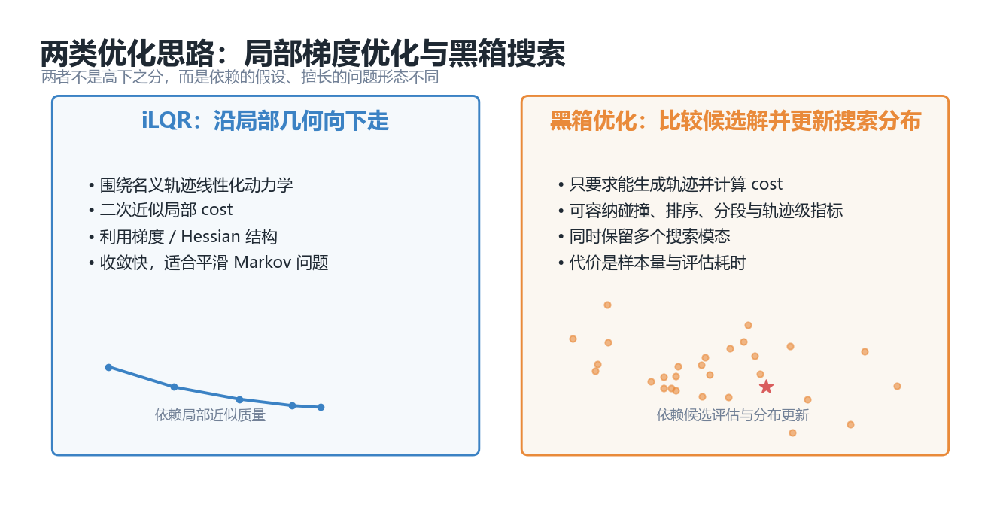

但是在自动驾驶交互规划中，很多关键 cost 并不适合 iLQR：

| 规划要素 | 为什么对梯度法不友好 |
| --- | --- |
| 碰撞检测 | box overlap、SAT、多边形距离常常是分段、不光滑的 |
| 道路边界 | hard clipping、道路拓扑切换会引入不连续 |
| 障碍物 blocked range | 本质上是区间逻辑判断 |
| 高等级 cost dominate 低等级 cost | 大权重层级会让梯度尺度非常不均衡 |
| 轨迹级 certificate | 依赖整条轨迹或终点未来展开，不是简单逐点 cost |
| 博弈 regret | 需要比较单边偏离后的最优响应，不是当前点的局部函数 |
| 多模态行为 | 让行、抢行、绕行、减速可能是离散行为模式 |

所以不是说 iLQR 不好，而是：

> iLQR 更像一个强大的局部光滑优化器；当规划问题包含大量离散逻辑、非光滑约束、非 Markov 评价和多模态交互时，它的适用假设会被削弱。

本项目选择黑箱优化，不是为了否定 iLQR，而是为了服务另一类问题：**cost 可以很复杂，甚至不可导，但只要能算出分数，就能比较候选轨迹。**

---

## 4. 黑箱轨迹优化的核心接口

黑箱优化的关键是把轨迹规划写成下面这个闭环：

```text
θ  ->  轨迹解码器 D(θ)  ->  轨迹 τ  ->  cost J(τ)  ->  优化器更新 θ 的分布
```

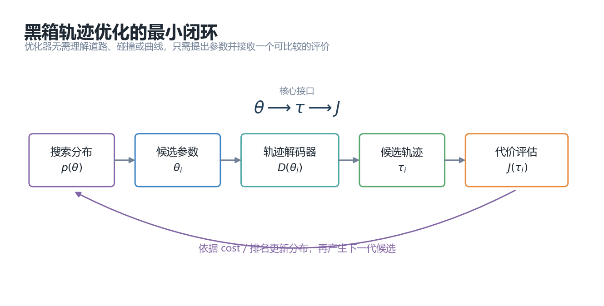

这里的 `θ` 是轨迹参数。它可以很低维，也可以很高维。

例如：

```text
θ = [l_end, v_end]
```

表示：

- 未来 5 秒末端横向位置。
- 未来 5 秒末端速度。

也可以是：

```text
θ = [l_ctrl_mid, l_end, v_end]
```

表示：

- 中间控制点横向位置。
- 终点横向位置。
- 终点速度。

只要有一个解码器能把 `θ` 变成完整轨迹：

```math
τ = D(θ)
```

优化器就可以只关心：

```math
J(D(θ))
```

这个接口非常重要。它把复杂规划问题切成两层：

| 层级 | 负责什么 |
| --- | --- |
| 轨迹模型 | 定义 `θ` 如何生成轨迹 |
| cost evaluator | 定义一条轨迹好不好 |
| optimizer | 不理解道路和车辆，只负责搜索更好的 `θ` |

因此，黑箱优化对 cost 的要求非常低：

- 不要求解析梯度。
- 不要求 Hessian。
- 不要求 cost 连续。
- 不要求 cost 可写成逐时刻 Markov 形式。
- 只要求给定一组参数后，能算出一个可比较的标量 cost。

这就是它适合复杂规划 cost 的根本原因。

---

## 5. 黑箱优化是不是“全局优化”

很多人会把黑箱优化称为全局优化。工程上可以这么理解：它比纯局部梯度法更擅长做全局搜索，能够在多个候选区域里比较不同模式。

但要注意：

> CMA-ES、IGO、随机搜索、SVGD 都不能保证在有限时间内找到数学意义上的全局最优。

更准确的说法是：

- 它们是**偏全局搜索**的方法。
- 它们通过采样保留多个候选方向。
- 它们不依赖单条名义轨迹附近的局部梯度。
- 它们可以跨过某些局部非光滑或局部坏梯度区域。
- 它们最终仍然受限于样本数、参数化表达能力、warm start 和 cost 设计。

所以在工程里更应该把它看成：

> 用可控计算量，在复杂不可导 cost 上做多模态候选搜索的优化框架。

---

## 6. 轨迹参数化：降低搜索维度的关键

如果直接优化未来 5 秒、每 0.1 秒一个轨迹点，那么一条轨迹大约有 51 个点。如果每个点都优化 `s, l, v`，维度会很高：

```text
51 * 3 = 153 维
```

这对采样优化很不友好，因为维度越高，需要的样本量越大。

因此，参数化轨迹的核心目的就是：

> 用少量参数表达一族合理轨迹，把高维轨迹搜索压缩成低维参数搜索。

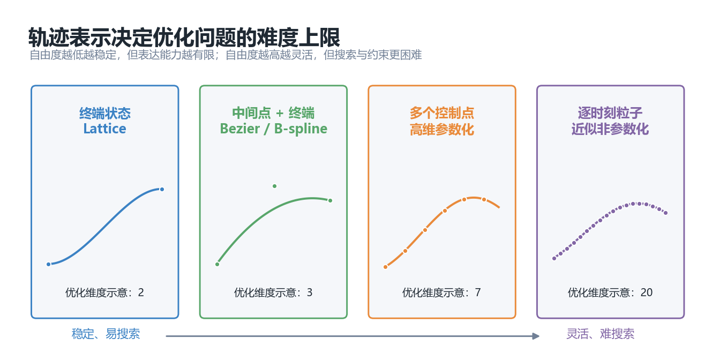

不同表示方式的取舍如下：

| 表示方式 | 优点 | 缺点 |
| --- | --- | --- |
| 终端状态参数化 | 维度低、稳定、优化快 | 表达中途绕行能力弱 |
| 中间控制点 + 终点 | 兼顾稳定与表达能力 | 参数、warm start 和 bounds 要设计好 |
| 多控制点曲线 | 表达能力强 | 容易摆动、超调，需要强约束 |
| 逐时刻粒子轨迹 | 最灵活 | 维度高，优化成本大，约束更难 |

本项目当前主推的思路是：

```text
固定未来 5 秒 T，不参数化 T。
优化低维轨迹参数 θ。
通过轨迹模型解码成完整时空轨迹。
```

这样每一帧都能严格输出未来 5 秒的轨迹，同时又允许优化器搜索轨迹形状。

---

## 7. 本项目里的主车轨迹模型

本项目的轨迹模型位于：

```text
spatiotemporal_joint_planner/trajectory_models/
```

当前重点轨迹模型如下。

### 7.1 lattice_trajectory

文件：

```text
spatiotemporal_joint_planner/trajectory_models/lattice_trajectory.py
```

参数为：

```text
θ = [l_end, v_end]
```

含义：

- `l_end`：未来 5 秒终点横向位置。
- `v_end`：未来 5 秒终点速度。

纵向使用 quartic profile，横向使用 quintic profile。它的优点是稳定、快、容易 warm start；缺点是中间绕行能力有限。

### 7.2 frenet_bezier_trajectory

文件：

```text
spatiotemporal_joint_planner/trajectory_models/frenet_bezier_trajectory.py
```

参数为：

```text
θ = [l_ctrl, l_end, v_end]
```

其中：

- `l_ctrl`：二次 Bezier 的中间横向控制点。
- `l_end`：终点横向位置。
- `v_end`：终点速度。

实际横向控制点为：

```text
[ego_l, l_ctrl, l_end]
```

它比 lattice 多了一个形状自由度，能够表示临时绕行、超车后回归等行为。

### 7.3 frenet_bspline_trajectory

文件：

```text
spatiotemporal_joint_planner/trajectory_models/frenet_bspline_trajectory.py
```

参数为：

```text
θ = [l_ctrl_mid, l_end, v_end]
```

实际横向 B-spline 控制点为：

```text
[ego_l, l_ctrl_mid, l_end]
```

实际速度控制点为：

```text
[ego_v, 0.5 * (ego_v + v_end), v_end]
```

这里非常重要：参数化、轨迹生成和可视化现在是一致的，不再出现“可视化看到 5 个控制点，但实际优化只有 3 个参数”的错位。

### 7.4 frenet_via_bspline_trajectory

这个模型使用：

```text
θ = [t_mid, l_mid, l_end, v_end]
```

它显式优化一个中间 via point 的时间和横向位置，因此表达力更强。但中间点时间如果离自车太近，轨迹会变得激进，所以需要 `min_mid_time`、`max_mid_time` 等约束。

### 7.5 svgd_particle_trajectory

这个模型目前更多是非参数化 / 粒子化方向的占位和接口准备。需要注意：

> “SVGD 优化器”与“粒子化轨迹表示”不是同一个概念。

SVGD 是一种粒子分布更新方法；粒子化轨迹表示是轨迹模型。未来要完整落地 SVGD，需要进一步处理非光滑 cost 下的梯度估计问题。

---

## 8. Warm Start 为什么重要

黑箱优化虽然不需要梯度，但它依赖候选样本。如果完全随机采样，优化器可能在有限时间内找不到好解。

所以本项目专门有 warm start 模块：

```text
spatiotemporal_joint_planner/planner/warm_start/
```

warm start 的作用是：

- 根据道路边界采样合理的横向终点。
- 根据当前速度采样合理的终点速度。
- 为不同轨迹模型生成可行的初始候选。
- 在滚动规划中利用上一帧结果作为下一帧初值。

例如 lattice 模式下，可以采样：

```text
l_end ∈ [道路右边界, 道路左边界]
v_end ∈ [当前速度 * 0.3, 当前速度 * 2.0]
```

同时考虑最大速度和最小速度限制。

这一步非常关键，因为 CMA-ES / IGO 不是凭空创造好轨迹，而是在 warm start 和采样分布附近逐步搜索。

---

## 9. CMA-ES：从随机采样到自适应分布搜索

最朴素的黑箱优化是随机搜索：

```text
随机采样很多 θ
计算每个 θ 的 cost
选择 cost 最小的 θ
```

但随机搜索效率低。CMA-ES 的改进是：

> 不只是采样，还要根据优秀样本更新下一轮采样分布。

CMA-ES 的分布通常是高斯分布：

```math
θ \sim \mathcal{N}(\mu, \Sigma)
```

其中：

- `μ` 是搜索中心。
- `Σ` 是协方差矩阵，描述搜索方向和尺度。

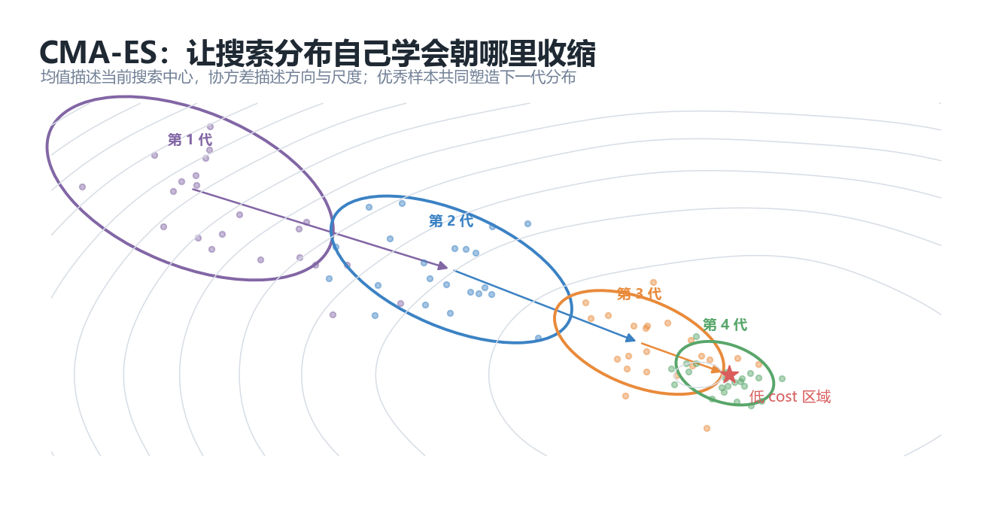

每一代大致流程是：

1. 从当前分布采样一批候选 `θ_i`。
2. 解码成轨迹 `τ_i`。
3. 计算 cost `J(τ_i)`。
4. 选出 elite 样本。
5. 用 elite 样本更新均值和协方差。
6. 搜索分布逐渐向低 cost 区域移动并收缩。

本项目中的 CMA-ES 实现位于：

```text
spatiotemporal_joint_planner/optimizer/cma_es_optimizer.py
```

配置项主要包括：

```yaml
optimizer:
  components: 2
  samples: 48
  iterations: 50
  elite_fraction: 0.25
  init_std: 0.22
  early_stop: true
```

其中 `components` 表示混合分布的模态数。保留多个 component 的意义是：规划行为可能本来就是多模态的，比如“让行”和“抢行”。

---

## 10. IGO：把优化器写成更统一的分布更新框架

IGO，全称 Information-Geometric Optimization。可以把它理解为：

> 在参数化概率分布族上，用样本排名来更新分布参数。

它关注的不是单个 `θ` 怎么更新，而是搜索分布 `p_η(θ)` 怎么更新。

```math
η \leftarrow η + \alpha \widetilde{\nabla}_{η}
```

这里 `η` 可以是高斯分布的均值和协方差，也可以是其他分布参数。

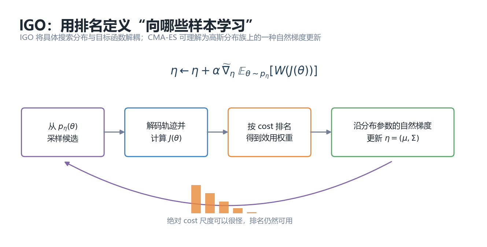

IGO 的优势在于：

- 它不依赖 cost 的绝对尺度。
- 它可以基于排名更新。
- 它能自然支持概率分布视角。
- CMA-ES 可以看作高斯分布族上的一种具体实现。

工程上，IGO 给本项目带来的好处是：

> 单车优化和博弈优化可以共享“分布采样、候选评估、基于排名更新”的统一思路。

---

## 11. SVGD：粒子分布优化的另一条路线

SVGD，全称 Stein Variational Gradient Descent。它通常用于让一组粒子逼近一个目标分布。

它有两个核心作用：

1. **吸引项**：让粒子靠近目标分布的高概率区域，也就是低 cost 区域。
2. **排斥项**：让粒子之间保持多样性，避免全部塌缩到同一个解。

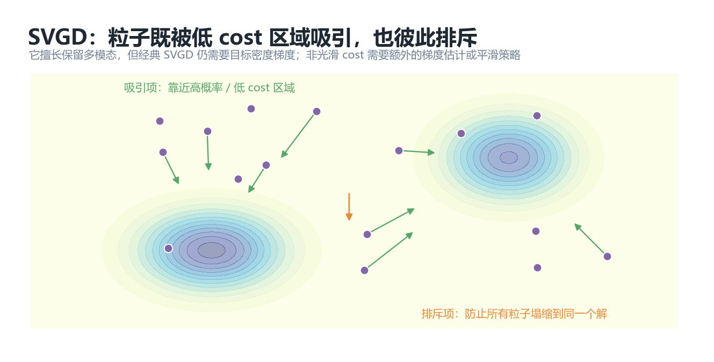

如果把规划问题写成：

```math
p(θ) \propto \exp(-J(D(θ))/\lambda)
```

SVGD 就可以尝试让粒子逼近这个分布。

但这里有一个很重要的工程问题：

> 经典 SVGD 需要目标密度的梯度，也就是需要 `∇θ J(D(θ))`。

如果 cost 是不可导的，例如碰撞逻辑、区间逻辑、Nash regret、轨迹级 certificate，那么直接用经典 SVGD 会遇到困难。

因此在本项目里，SVGD 更适合作为后续方向：

- 对部分 cost 做平滑近似。
- 对不可导部分使用有限差分。
- 使用 zeroth-order gradient estimator。
- 或者只在可导 surrogate cost 上做粒子更新。

换句话说，SVGD 很有潜力，但它不是“无需梯度的 CMA-ES 替代品”。

---

## 12. 为什么要做 numpy 向量化

黑箱优化的主要计算量来自大量候选轨迹评估。

如果一次迭代有：

```text
samples = 48
iterations = 50
```

那么一帧最多可能评估：

```text
48 * 50 = 2400 条候选轨迹
```

如果每条轨迹再有 51 个时间点，那么逐条 Python 循环会非常慢。

所以本项目做了 batch decode 和 batch evaluate：

```text
parameters_batch: (B, D)
    -> trajectory_batch: (B, T)
    -> cost_batch: (B,)
```

这让大量 Markov cost 可以在 numpy 内部并行计算。

需要理解的是：

> 这里的“并行”不是多线程显式并行，而是 numpy 把数组计算下沉到底层 C / BLAS 循环里，从 Python 层看是一次批量操作。

这对 lattice、Frenet Bezier、Frenet B-spline 这类 Frenet 轨迹尤其重要，因为如果 cost 可以直接在 `s-l` 空间评估，就能避免大量 `s-l -> x-y` 投影。

---

## 13. 固定 5 秒未来与滚动时域规划

本项目每一帧都规划未来固定 5 秒轨迹。

这不代表一条轨迹会完整执行 5 秒。真实执行方式是：

1. 当前帧规划未来 5 秒。
2. 只执行最前面一小段。
3. 环境状态更新。
4. 下一帧重新规划未来 5 秒。

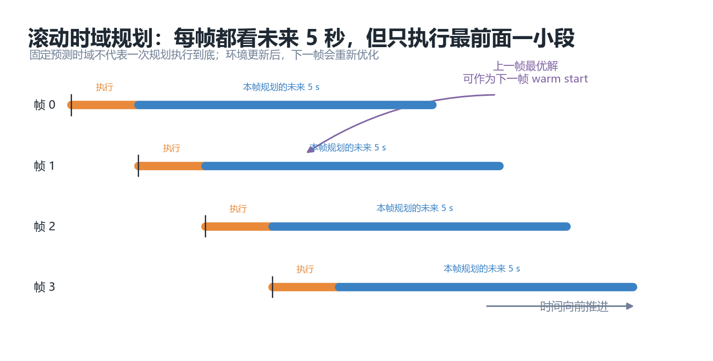

这种方式叫 receding horizon planning，也就是滚动时域规划。

它的意义是：

- 规划输出始终是固定长度，便于控制器消费。
- 每一帧都能根据最新障碍物和交互状态修正。
- 上一帧的最优解可以作为下一帧 warm start。
- 即使他车没有完全按照预测走，也能在下一帧纠偏。

这也是为什么本项目坚持不把 `T` 做成优化变量：工程上每一帧需要稳定输出未来固定时域的轨迹。

---

## 14. 从固定预测到联合博弈

传统规划通常把他车轨迹当成预测输入：

```text
他车预测轨迹固定
自车在这个固定环境里优化
```

这种方式简单，但有一个问题：

> 他车不是静态障碍物，它可能会根据自车行为改变自己的行为。

比如换道场景：

- 自车想并入目标车道。
- 目标车道后车可能让，也可能抢。
- 如果自车认为后车一定匀速，就可能误判 gap。
- 如果后车认为自车一定不插入，也可能做出不同反应。

所以更高级的方式是联合生成轨迹：

```text
同时优化自车轨迹和关键他车轨迹
```

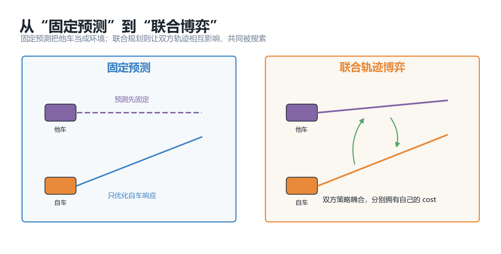

这时问题从单智能体规划变成博弈：

```math
\theta^*_{ego}, \theta^*_{rear}
```

其中：

- 自车有自己的 cost。
- 后车有自己的 cost。
- 双方轨迹互相影响。
- 这个问题一般是 general-sum game，不是简单的单目标最小化。

---

## 15. 本项目的 IGO 博弈框架

博弈相关代码位于：

```text
spatiotemporal_joint_planner/game/
```

核心模块包括：

| 模块 | 作用 |
| --- | --- |
| `game_parametric_planner.py` | 构建自车与目标他车的联合规划问题 |
| `igo_game_optimizer.py` | 基于 IGO / CMA-ES 思路优化多玩家参数分布 |
| `game/cost/vehicle_game_cost.py` | 他车玩家 cost |
| `game/trajectory_models/vehicle_longitudinal_trajectory.py` | 他车纵向轨迹模型 |

当前实现先聚焦两玩家：

```text
player 1: ego
player 2: target_lane_rear_vehicle
```

自车可以使用：

```text
lattice_trajectory
frenet_bezier_trajectory
frenet_bspline_trajectory
frenet_via_bspline_trajectory
```

后车使用纵向参数化：

```text
θ_rear = [s_end, v_end]
```

也就是说，后车主要在目标车道上优化未来纵向行为，比如：

- 保持速度。
- 减速让行。
- 加速抢行。
- 避免撞前车或自车。

### 15.1 联合候选采样

博弈优化器会分别维护玩家的搜索分布：

```text
p_ego(θ_ego)
p_rear(θ_rear)
```

然后组合成联合候选：

```text
(θ_ego_i, θ_rear_i)
```

每个联合候选会解码成：

```text
τ_ego_i
τ_rear_i
```

再分别计算：

```text
J_ego(τ_ego_i, τ_rear_i)
J_rear(τ_rear_i, τ_ego_i)
```

注意，这不是把两个 cost 简单相加。每个玩家都有自己的目标，因此它是一个博弈问题。

### 15.2 为什么不是单纯最小化 joint cost

如果直接定义：

```math
J_{joint}=J_{ego}+J_{rear}
```

然后最小化它，可能会得到一个“整体看起来不错，但某一方完全不愿意执行”的解。

比如：

- 自车轨迹要求后车大幅刹车。
- 后车自己的 cost 下其实更愿意加速。
- 那么这个联合轨迹在真实世界中不稳定，因为后车不会按这个解执行。

所以博弈规划的关键不是“联合 cost 最低”，而是：

> 当前联合解下，任何一个玩家单独改变自己的轨迹，都不能明显降低自己的 cost。

这就是 Nash 均衡的语义。

---

## 16. Nash / regret 检查为什么重要

本项目中，博弈收敛不只看 cost 是否不变，还会做近似 Nash / regret 检查。

对于当前联合解：

```math
(\theta_{ego}^*, \theta_{rear}^*)
```

检查自车时，固定后车：

```math
\theta_{rear} = \theta_{rear}^*
```

然后看自车能不能通过单边偏离找到更低 cost：

```math
J_{ego}^{BR} = \min_{\theta_{ego}} J_{ego}(\theta_{ego}, \theta_{rear}^*)
```

自车 regret 是：

```math
r_{ego}=J_{ego}^*-J_{ego}^{BR}
```

后车同理：

```math
r_{rear}=J_{rear}^*-J_{rear}^{BR}
```

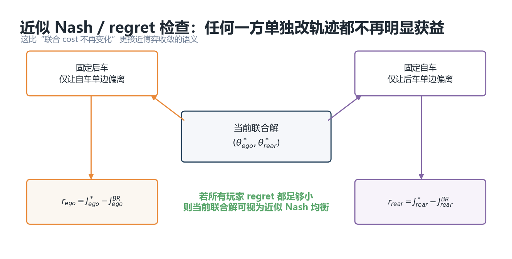

如果所有玩家的 normalized regret 都足够小：

```text
max_regret <= nash_regret_tol
```

那么可以认为当前联合解接近 Nash 均衡。

本项目默认配置中：

```yaml
optimizer:
  nash_check: true
  nash_regret_tol: 0.02
  nash_candidate_limit: 20
  nash_perturbation: 0.04
  joint_theta_window_tol: 0.05
  joint_cost_window_tol: 0.002
```

这些参数含义是：

| 参数 | 含义 |
| --- | --- |
| `nash_regret_tol` | 允许的最大单边收益比例 |
| `nash_candidate_limit` | 检查单边偏离时使用的候选数量 |
| `nash_perturbation` | 在当前解附近额外扰动的尺度 |
| `joint_theta_window_tol` | 最近窗口内 joint theta 的稳定阈值 |
| `joint_cost_window_tol` | 最近窗口内 joint cost 的稳定阈值 |

工程上可以这样理解：

- 如果轨迹来回跳，通常需要收紧 joint theta 稳定性或增加最小迭代数。
- 如果收敛太慢，可以放宽 regret 或 joint window 阈值。
- 如果看起来“收敛了但博弈不合理”，应提高 Nash 检查候选数量。

---

## 17. 交互换道中的 temporal blocked range

在动态障碍物场景中，不能只用一个静态 blocked range。

应当使用：

```text
temporal_blocked_range[t]
```

也就是未来每个时间点的障碍物占用区间。

例如未来 5 秒，每 0.1 秒一个点：

```text
t = 0.0, 0.1, 0.2, ..., 5.0
```

每个时刻都存储障碍物的：

```text
s_range = [s_min, s_max]
l_range = [l_min, l_max]
```

碰撞 cost 计算时，需要把自车轨迹点和同一时刻的障碍物 blocked range 对齐：

```text
ego(t_k) vs obstacle_blocked_range(t_k)
```

这样才能表达：

- 当前安全，但 2 秒后会撞。
- 当前有 gap，但后车加速后 gap 消失。
- 自车插入时，后车需要让行或抢行。

这也是交互博弈的基础：他车轨迹不再只是固定预测，而是 joint optimization 的一部分。

---

## 18. Cost 设计：为什么要分等级

黑箱优化虽然不需要梯度，但它非常依赖 cost 设计。

如果所有 cost 简单相加，就会出现一个常见问题：

```text
为了贴参考线，车辆宁愿在障碍物前方大幅减速。
```

或者：

```text
为了追求速度，车辆接受不合理的曲率或横向加速度。
```

因此本项目使用分等级 cost：

```text
安全 > 道路边界 > 动力学硬约束 > 效率 > 轨迹级长期价值 > 参考线 > 舒适性
```

这种设计的核心不是让数值漂亮，而是让优化器在排序候选轨迹时遵循工程语义。

### 18.1 硬约束与软约束

例如横向加速度：

- 硬约束：超过最大 / 最小横向加速度会产生高等级 cost。
- 软约束：即使没超限，也鼓励横向加速度接近 0，提高舒适性。

同理：

- `kappa` 有硬约束和软约束。
- `dkappa` 有硬约束和软约束。
- `lateral_jerk` 有硬约束和软约束。

### 18.2 为什么 score 要归一化

如果某个原始 cost 数值范围很大，它会破坏等级结构。

因此本项目使用类似 saturate 的方式把 score 压到可控范围：

```text
raw cost -> score ∈ [0, 1]
```

再乘以等级权重：

```text
1e9, 1e8, 1e7, ...
```

这比直接堆权重更稳定。

---

## 19. 轨迹级 certificate cost

轨迹级 certificate cost 是为了补充 Markov cost 的不足。

Markov cost 可能看到：

```text
当前 5 秒轨迹安全
```

但它未必知道：

```text
轨迹末端是不是把车带到了一个很难继续行驶的位置
```

因此可以设计 terminal value：

- 轨迹终点是否还有足够通行空间。
- 轨迹终点速度是否合理。
- 轨迹终点横向状态是否可恢复。
- 轨迹终点线性递推后是否会快速遇到阻塞。

本项目中这类 cost 被统一放在：

```text
_trajectory_level_certificate_terms(...)
```

这样做的好处是：

- 可以整体开关。
- 可以逐个子项调试。
- 不会把非 Markov cost 混进逐点 cost 里。
- 如果效果不好，可以快速定位是哪一个 certificate 项影响了行为。

---

## 20. 当前项目结构

核心目录：

```text
spatiotemporal_joint_planner/
├── common/                 # 数据结构：状态、轨迹、问题、cost 结果
├── config/                 # demo 和 scenario YAML 配置
├── cost/                   # 单车轨迹 cost
├── game/                   # IGO 博弈规划
├── optimizer/              # CMA-ES / 参数分布优化
├── planner/                # planner 与 warm start
├── scenario/               # static_nudge、lane_change、交互换道等场景
├── trajectory_models/      # 各类轨迹参数化模型
└── demo.py                 # 仿真入口与可视化
```

几个关键文件：

| 文件 | 说明 |
| --- | --- |
| `optimizer/cma_es_optimizer.py` | 单车参数化 CMA-ES 优化 |
| `planner/parametric_planner.py` | 单车参数化规划器 |
| `cost/parametric_trajectory_cost.py` | 单车 cost 层级与 batch evaluation |
| `game/igo_game_optimizer.py` | IGO 博弈优化器 |
| `game/game_parametric_planner.py` | 联合轨迹博弈规划器 |
| `trajectory_models/lattice_trajectory.py` | `[l_end, v_end]` 参数化 |
| `trajectory_models/frenet_bezier_trajectory.py` | `[l_ctrl, l_end, v_end]` 参数化 |
| `trajectory_models/frenet_bspline_trajectory.py` | `[l_ctrl_mid, l_end, v_end]` 参数化 |

---

## 21. 如何运行几个典型仿真

### 21.1 静态绕行，lattice 模式

```powershell
python -B -m spatiotemporal_joint_planner.demo `
  --scenario static_nudge `
  --trajectory-model lattice_trajectory `
  --max-steps 100 `
  --show
```

### 21.2 静态绕行，Frenet Bezier 模式

```powershell
python -B -m spatiotemporal_joint_planner.demo `
  --scenario static_nudge `
  --trajectory-model frenet_bezier_trajectory `
  --max-steps 100 `
  --show
```

### 21.3 交互换道，单车规划

```powershell
python -B -m spatiotemporal_joint_planner.demo `
  --scenario interactive_lane_change `
  --trajectory-model lattice_trajectory `
  --max-steps 150 `
  --show
```

### 21.4 交互换道，IGO 博弈规划

```powershell
python -B -m spatiotemporal_joint_planner.demo `
  --scenario interactive_lane_change `
  --trajectory-model lattice_trajectory `
  --set planner.type=game `
  --max-steps 150 `
  --show
```

### 21.5 高密度目标车道换道，IGO 博弈规划

```powershell
python -B -m spatiotemporal_joint_planner.demo `
  --scenario dense_target_lane_change `
  --trajectory-model lattice_trajectory `
  --set planner.type=game `
  --max-steps 150 `
  --show
```

---

## 22. 项目效果示例

下面这些 GIF 是项目已有可视化结果，展示了不同轨迹模型和场景下的行为。

### 22.1 静态绕行

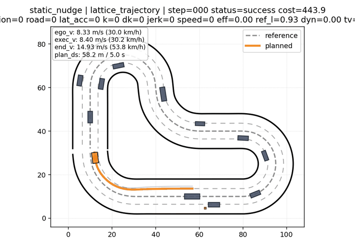

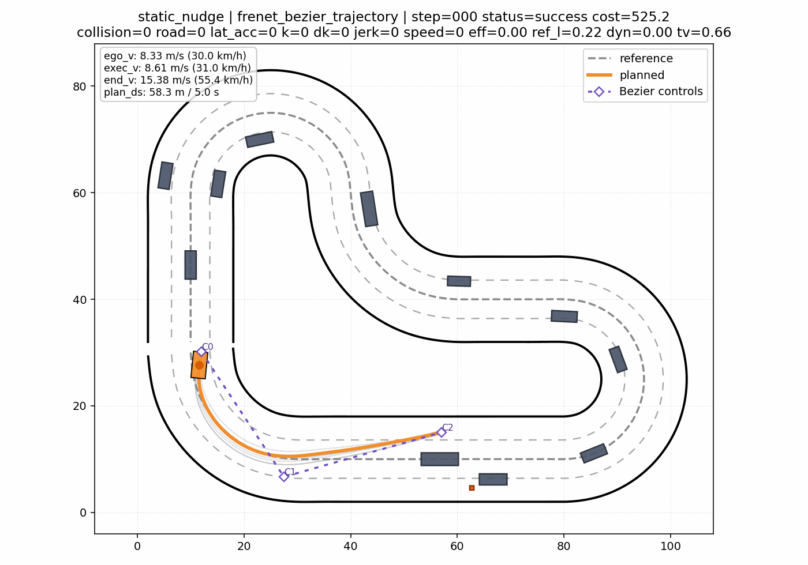

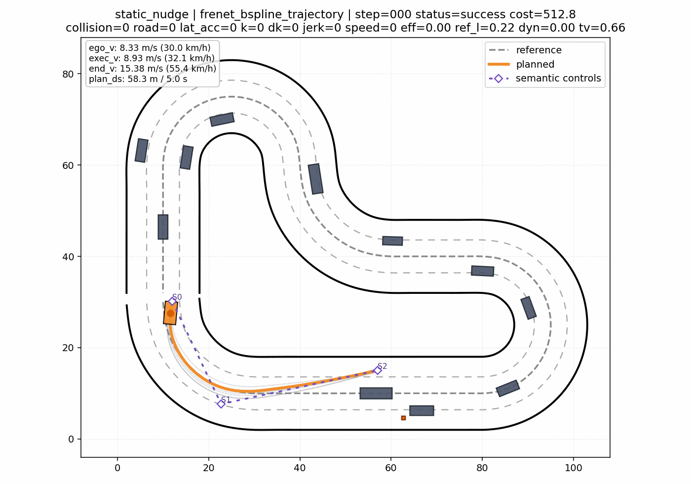

### 22.2 交互换道

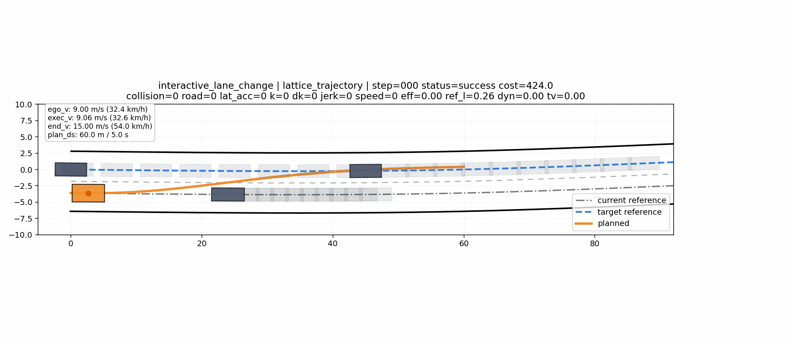

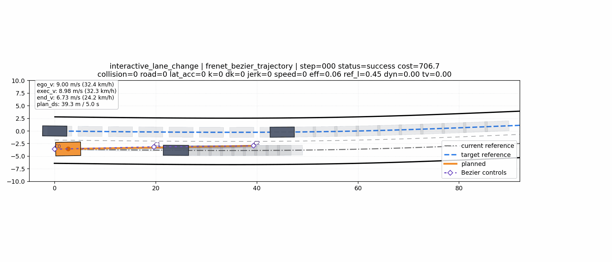

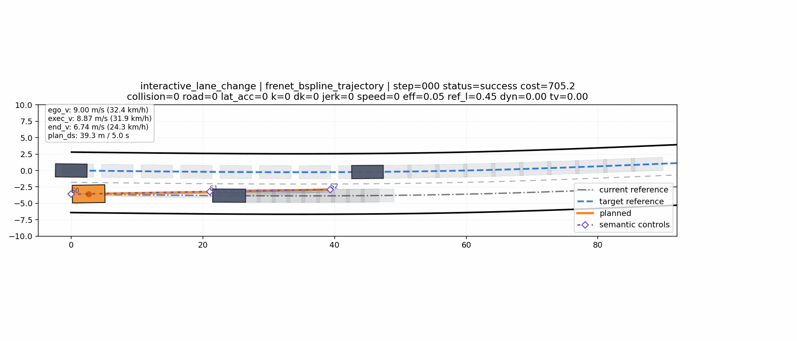

### 22.3 高密度目标车道换道

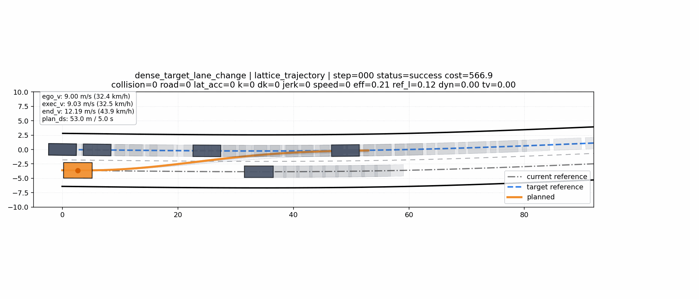

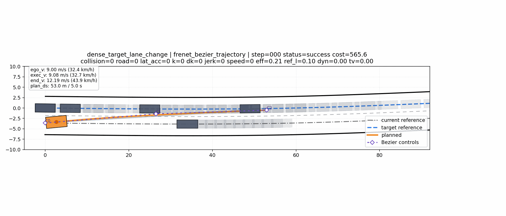


---

## 23. 这套框架的优势

### 23.1 Cost 可以更贴近工程语义

因为不要求可导，所以可以直接使用：

- box blocked range。
- temporal blocked range。
- 多等级 cost。
- 轨迹级 certificate。
- Nash regret。
- 行为模式评价。

这让 cost 设计可以更接近真实规划需求，而不是被可导性强行限制。

### 23.2 可以自然支持多模态

换道场景里常常存在多个合理行为：

- 加速插入。
- 减速让行。
- 留在当前车道等待。
- 先绕行再回目标车道。

混合分布和 warm start 可以保留这些候选模式，而不是过早塌缩到一个局部解。

### 23.3 可以扩展到博弈

单车规划只需要优化：

```text
θ_ego
```

博弈规划扩展为：

```text
θ_ego, θ_rear
```

优化器仍然是“采样、评估、排名、更新”，只是评估从单车 cost 变成多玩家 cost。

---

## 24. 当前局限与后续方向

这套框架不是没有代价。

### 24.1 采样优化计算量更大

黑箱优化需要评估大量候选。虽然 numpy 向量化已经显著加速，但如果要上更复杂博弈、多玩家、多模态预测，仍然需要继续优化：

- 更强 batch 化。
- C++ 实现。
- CUDA / GPU batch evaluation。
- 更高质量 warm start。
- 更少但更有效的候选采样。

### 24.2 参数化表达能力仍然关键

如果轨迹模型表达不了某种行为，优化器再强也找不到。

例如：

- `lattice_trajectory` 很稳定，但中间绕行能力有限。
- 高自由度 B-spline 表达能力强，但可能摆动。
- 结构化 3 控制点 B-spline 是一种折中。

所以参数化不是细节，而是规划能力的上限之一。

### 24.3 SVGD 还需要进一步设计

SVGD 的优势是粒子多样性，但经典 SVGD 对梯度有要求。本项目未来如果要做完整 SVGD，需要解决：

- 不可导 cost 的梯度估计。
- 粒子轨迹的动力学可行性。
- 粒子间 repulsion 与轨迹平滑性的平衡。
- 与 IGO / CMA-ES 的混合使用方式。

### 24.4 Contingency planning 当前实现到隐式阶段

真实他车不一定按照联合规划轨迹执行。当前项目已经加入第一阶段隐式 contingency：

- 将目标后车建模为 yielding、normal、aggressive 等潜在类型。
- 所有类型假设共享同一个自车决策。
- 每种类型分别优化对应的后车响应轨迹。
- 使用 belief 加权期望与 CVaR 聚合自车风险。
- 根据闭环观测更新类型概率。当前固定时间窗滤波器联合使用纵向位置、速度、加速度、累计位移和速度变化证据，并通过概率下限与遗忘因子避免过早锁死。

更完整的显式 contingency planning 仍然可以进一步加入：

- 为他车多种可能行为保留分支。
- 自车前半段共享，后半段根据他车行为分叉。
- cost 中考虑最坏情况或风险加权。

当前实现依靠共享自车轨迹和逐帧重新规划形成隐式 contingency，但尚未显式输出共享前缀与条件分支树。

---

## 25. 最后一层理解：IGO 规划到底比传统方法高级在哪里

这套方法的核心价值不是“用了 CMA-ES”或者“用了 IGO”这几个名字，而是它把轨迹规划变成了一个更通用的优化接口：

```text
复杂轨迹生成器
    +
不可导、多等级、非 Markov、博弈式 cost
    +
基于分布的黑箱搜索
```

这样一来，我们可以把很多传统梯度法不方便表达的规划知识直接放进 cost：

- 安全等级。
- 道路边界。
- 未来可恢复性。
- 动态障碍物 temporal blocked range。
- 自车与他车联合行为。
- Nash / regret 检查。

所以本项目的主线可以概括为：

> 用低维但足够表达力的轨迹参数化，配合分布式黑箱优化，在不可导复杂 cost 上搜索安全、高效、可交互的未来轨迹；再把这一套从单车规划扩展到多玩家博弈，联合生成自车与关键他车轨迹。

如果你是第一次接触黑箱轨迹优化，可以先记住一句话：

> 只要一条轨迹能被生成出来，并且能被评价好坏，黑箱优化就有机会搜索它；轨迹参数化决定搜索空间，cost 设计决定行为偏好，分布更新决定搜索效率。
